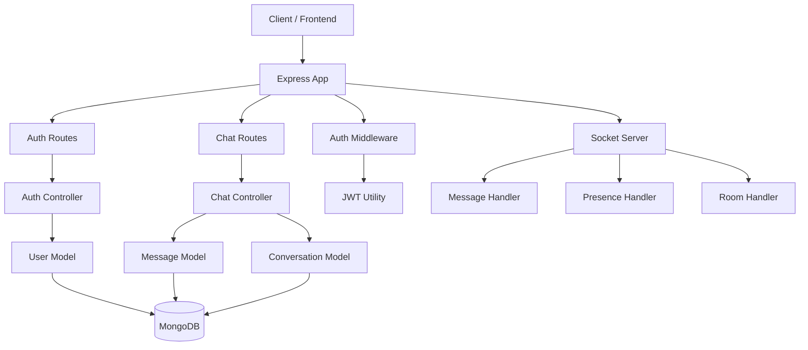

# Real-Time Chat Application – Beginner-Friendly Project Guide

This project is a full-stack real-time chat application built with Node.js, Express, TypeScript, MongoDB, Mongoose, JWT, bcrypt, and Socket.IO. It is designed to show how a modern chat system works from the backend side, including authentication, real-time messaging, conversations, and presence tracking.

---

## 1. What this project does

This application allows users to:

- Sign up and log in securely
- Send and receive messages in real time
- View conversations with other users
- See online presence and typing activity
- Mark messages as delivered or read
- Handle message deletion softly without removing data permanently

In simple words, this project is a backend system for a chat app that behaves like WhatsApp or Messenger, but in a simplified form.

---

## 2. Why this project is important

This project is a strong example of a real-world backend application because it combines several important concepts:

- Authentication
- Database design
- API development
- Real-time communication
- User session handling
- Secure password management
- Backend architecture

If you are preparing for an interview, this project is great because it shows that you understand how modern web applications are built.

---

## 3. Main technologies used

### Backend runtime

- Node.js
- TypeScript

### Web framework

- Express.js

### Database

- MongoDB
- Mongoose

### Authentication

- JWT (JSON Web Token)
- bcrypt

### Real-time communication

- Socket.IO

### Validation

- Zod

---

## 4. Project flow from start to finish

The best way to read this project is in order. Follow this sequence so you understand how each part connects to the next.

### Step 1: Start the server

File: src/server.ts

This is the entry point of the application.

- It creates the HTTP server
- It starts the Express app
- It attaches Socket.IO to the server
- It listens on a port and makes the project live

Dependency flow:

- src/server.ts -> imports src/app.ts
- src/server.ts -> imports src/socket/socketServer.ts

### Step 2: Create the Express application

File: src/app.ts

This file sets up the main web server.

- It loads middleware like JSON parsing, cookies, and CORS
- It connects to MongoDB
- It registers the API routes
- It exposes a health endpoint

Dependency flow:

- src/app.ts -> imports src/database/db.ts
- src/app.ts -> imports src/routes/auth.routes.ts
- src/app.ts -> imports src/routes/chat.routes.ts

### Step 3: Load and validate environment variables

File: src/config/env.ts

This file makes sure all required environment values are available.

- It validates things like port, MongoDB URI, and JWT secret
- It prevents the server from starting with broken configuration

Dependency flow:

- src/server.ts and src/app.ts rely on this configuration

### Step 4: Connect the database

File: src/database/db.ts

This file connects the application to MongoDB using Mongoose.

- It uses the MongoDB URI from env.ts
- Without this, the app cannot store or retrieve data

Dependency flow:

- src/app.ts calls this during startup
- Models in src/models/ depend on this database connection

### Step 5: Define the database models

Files:

- src/models/user.models.ts
- src/models/message.models.ts
- src/models/conversation.models.ts

These files define the structure of your data.

- User model stores account information and status
- Message model stores chat content and status fields
- Conversation model stores chat threads and participants

Dependency flow:

- Controllers use these models
- Socket logic also uses them to send and save messages

### Step 6: Build authentication flow

Files:

- src/controllers/auth.controller.ts
- src/routes/auth.routes.ts
- src/middleware/auth.middleware.ts
- src/utils/jwt.ts

This part handles user login and protection.

- Signup and login endpoints create or verify users
- Passwords are hashed with bcrypt
- JWT tokens are generated and verified
- Auth middleware checks whether a request is allowed

Dependency flow:

- auth routes -> auth controller -> user model -> JWT utility
- chat routes later depend on auth middleware for protection

### Step 7: Create chat routes and controllers

Files:

- src/controllers/chat.controller.ts
- src/routes/chat.routes.ts

This is the API layer for chat features.

- It lets users fetch conversations and users
- It sends messages through HTTP endpoints
- It supports pagination, soft delete, and read status

Dependency flow:

- chat routes use auth middleware
- chat controller uses message and conversation models

### Step 8: Add real-time Socket.IO functionality

Files:

- src/socket/socketServer.ts
- src/socket/message.ts
- src/socket/presence.ts
- src/socket/rooms.ts
- src/socket/events.ts

This layer makes the app feel live.

- Socket server handles connections and authentication
- Message handler sends and receives live chat events
- Presence handler tracks online status
- Rooms handler manages room joining and leaving
- Events file defines shared event names

Dependency flow:

- src/server.ts attaches the socket server
- socket handlers use the same models as the REST controllers

### Step 9: Connect everything together

At the end, the full request flow looks like this:

1. User starts the app
2. Server starts and connects to MongoDB
3. User signs up or logs in
4. JWT token is issued
5. User calls chat APIs or connects through sockets
6. Messages are saved in MongoDB and broadcast in real time
7. Presence and typing updates are sent to other users

---

## 5. Visual project flow with boxes and arrows

Here is the architecture in a simple visual form.

```text
[ Client / Frontend ]
        |
        v
[ Express App ] --> [ Auth Routes ] --> [ Auth Controller ] --> [ User Model ]
        |
        +--> [ Chat Routes ] --> [ Chat Controller ] --> [ Message Model ]
        |
        +--> [ Auth Middleware ] --> [ JWT Utility ]
        |
        +--> [ Socket Server ] --> [ Message Handler ]
                                  |
                                  +--> [ Presence Handler ]
                                  |
                                  +--> [ Room Handler ]

[ MongoDB / Mongoose ] <--- [ User Model ]
[ MongoDB / Mongoose ] <--- [ Message Model ]
[ MongoDB / Mongoose ] <--- [ Conversation Model ]
```

### Simple explanation of the flow

- The client sends requests to the Express app
- Auth routes handle signup and login
- Chat routes manage conversations and messages
- Controllers talk to the database models
- Socket.IO handles live updates like typing and new messages
- MongoDB stores the final data

### Mermaid diagram



### File dependency map

- src/server.ts
  - starts the app
  - connects socket server

- src/app.ts
  - loads middleware
  - connects database
  - registers routes

- src/config/env.ts
  - provides configuration to server and app

- src/routes/auth.routes.ts
  - depends on auth controller

- src/routes/chat.routes.ts
  - depends on chat controller and auth middleware

- src/controllers/auth.controller.ts
  - depends on user model and JWT utility

- src/controllers/chat.controller.ts
  - depends on message model, conversation model, and user model

- src/socket/socketServer.ts
  - depends on message, presence, and room handlers

- src/socket/message.ts
  - depends on message, conversation, and user models

- src/models/user.models.ts
  - used by auth and chat logic

- src/models/message.models.ts
  - used by chat and socket logic

- src/models/conversation.models.ts
  - used by chat and message flow

---

## 6. Project structure explained by file purpose

Here is the meaning of the main folders:

- src/app.ts
  - Main Express app setup
  - Middleware and route registration happen here

- src/server.ts
  - Starts the server and attaches the Socket.IO server

- src/config/env.ts
  - Loads and validates environment variables

- src/controllers/
  - Contains business logic for authentication and chat operations

- src/routes/
  - Defines API endpoints for auth and chat features

- src/models/
  - Defines database schemas for users, messages, and conversations

- src/middleware/
  - Protects routes using JWT authentication

- src/socket/
  - Handles real-time socket events like messaging, typing, presence, and rooms

- src/utils/
  - Utility functions such as JWT helpers

---

## 6. Core features explained simply

### 5.1 Authentication

Authentication is the process of verifying who a user is.

In this project:

- Users can sign up with a username, email, and password
- Passwords are hashed using bcrypt before storing in the database
- A JWT token is generated after login
- That token is used to protect private routes

Why it matters:

- It keeps the app secure
- It ensures only logged-in users can access private features

### 5.2 User management

The app stores user data such as:

- username
- email
- password hash
- status
- last seen

This allows the system to identify users and manage their presence.

### 5.3 Conversations

A conversation represents a chat thread between users.

This project supports:

- Private conversations
- Group-based chat foundation

It helps organize messages under a single thread instead of storing everything randomly.

### 5.4 Messages

Messages are stored with important details like:

- sender
- receiver
- room name
- content
- status
- read information

This makes the message system practical and scalable.

### 5.5 Cursor pagination

Instead of loading all messages at once, the app uses cursor-based pagination.

This means:

- older messages can be loaded in chunks
- the app remains fast even with many messages
- it provides a smoother user experience

### 5.6 Soft delete

Soft delete means a message is marked as deleted instead of being permanently removed.

Why this is useful:

- You preserve data for auditing or recovery
- The app can avoid hard data loss
- It is a common pattern in real systems

### 5.7 Socket.IO real-time communication

Socket.IO enables real-time events between server and client.

This project uses it for:

- sending messages instantly
- showing typing indicators
- tracking online presence
- sending delivered and read events

This is what makes the app feel like a real-time chat application.

### 5.8 Presence tracking

Presence tracking tells whether a user is online or active.

This is useful for features like:

- showing if a friend is online
- indicating when someone is currently active

### 5.9 Typing indicators

When one user is typing, the server can notify the other user in real time.

This improves the chat experience and makes the app feel interactive.

### 5.10 Delivery and read events

The app can track whether a message was:

- sent
- delivered
- seen

These statuses help create a more realistic messaging experience.

### 5.11 Duplicate message prevention

The app uses a client message ID to avoid saving the same message multiple times.

This is useful because network retries or duplicate events can accidentally send the same message twice.

---

## 6. How the backend flow works

### Step 1: User signs up or logs in

The user sends credentials to the authentication route.

The server:

- validates the inputs
- checks the database
- creates the user or verifies login
- returns a JWT token

### Step 2: User accesses protected routes

The JWT token is attached to the request.

The auth middleware verifies the token and allows access only if it is valid.

### Step 3: User sends a message

The client sends the message to the server.

The server:

- checks the recipient
- creates or uses a conversation
- stores the message in MongoDB
- broadcasts it using Socket.IO

### Step 4: Real-time updates happen

Other users in the same chat room receive events such as:

- new message
- typing status
- delivery/read updates

---

## 7. How MongoDB is used

MongoDB stores all the major chat data.

The main collections/schemas are:

- Users
  - Stores account information

- Messages
  - Stores all chat messages

- Conversations
  - Stores chat threads between users

Mongoose is used to define the structure of this data and make database operations easier.

---

## 8. Why this project is good for interviews

This project is impressive in interviews because it shows you can build a backend that is:

- Secure
- Scalable in structure
- Real-time capable
- Database-driven
- Practical and industry relevant

When explaining it in an interview, you can say:

> I built a real-time chat backend using Node.js, Express, TypeScript, MongoDB, and Socket.IO. The application supports user authentication with JWT and bcrypt, real-time messaging, presence tracking, typing indicators, delivery/read status, soft delete, and cursor-based pagination. The architecture is organized into controllers, routes, models, middleware, and socket handlers to keep the project maintainable.

---

## 9. Interview-ready explanation

If you want to explain this project in a simple interview answer, use this:

"This project is a real-time chat application backend built with Node.js, Express, and TypeScript. It includes user authentication using JWT and bcrypt, message storage in MongoDB using Mongoose, real-time communication through Socket.IO, conversation handling, typing indicators, presence tracking, message status updates, and soft delete support. The project is organized in a feature-based structure with separate folders for routes, controllers, models, middleware, and socket events, which makes it clean and easier to extend."

---

## 10. What you learned from this project

By building this project, you learn:

- How authentication works in a real backend
- How to structure a Node.js project professionally
- How to connect a backend with MongoDB
- How to build real-time features with Socket.IO
- How to design chat functionality in a scalable way
- How to explain backend architecture clearly in interviews

---

## 11. Future improvements

You can extend this project later with:

- group chat UI
- file uploads
- voice messages
- notifications
- message search
- online/offline history
- Redis for scaling

---

## 12. Final note

This project is not just a chat app. It is a complete example of backend engineering, real-time systems, user authentication, and database-driven application design. That is why it is a strong project to showcase in interviews.
